# Code-Quiz-Webpage
This Repo contains code and webpages that will prompt a user to answer questions in a timed manner.
Users are presented with a start page and upon clicking the begin button, the site will transition into the questions portion of the page.
Whenever a responde is selected the page will load a new question, and if the wrong option is selected 10 seconds will be deducted from the overall timer.
After all the questions are answered or the timer runs out, the score.html page will open and there it will ask fo0r your initials and store them along with the user's score.
Finally, on the score.html page all previous users' score's and initial's will be sorted from lowest at the bottom to highest at the top.

# Images

Included below are Screenshots of various code and webpages that are associated with this Challenge.

.PNG)

.PNG)

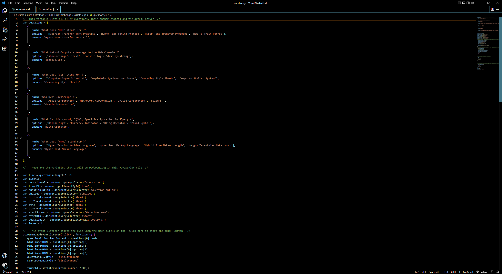

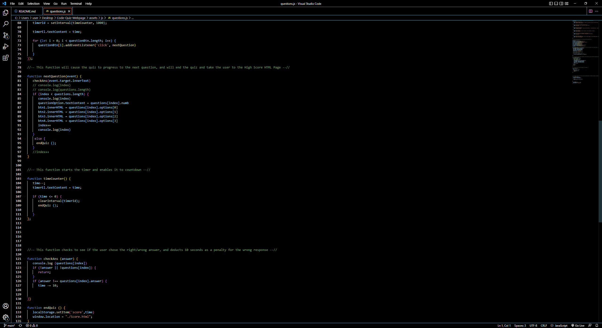 

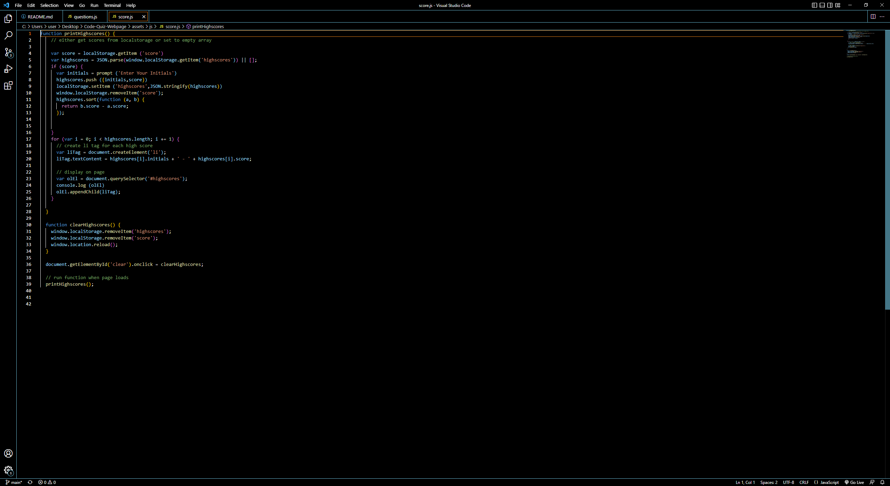

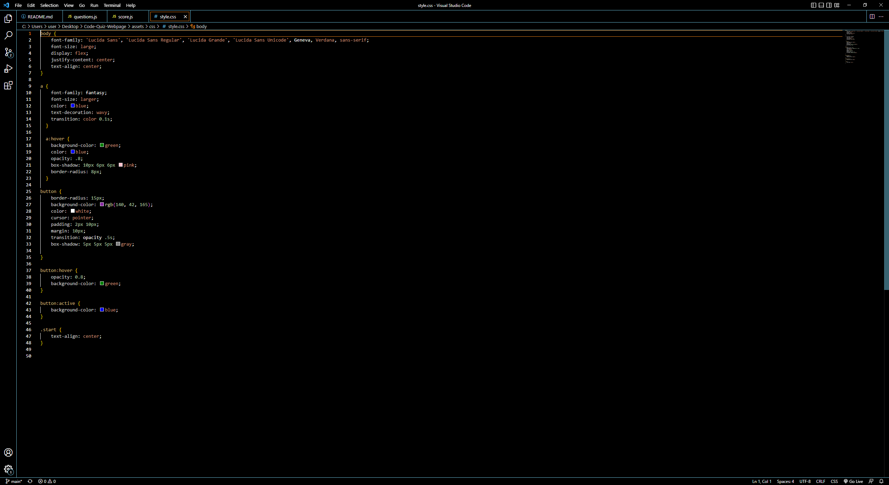

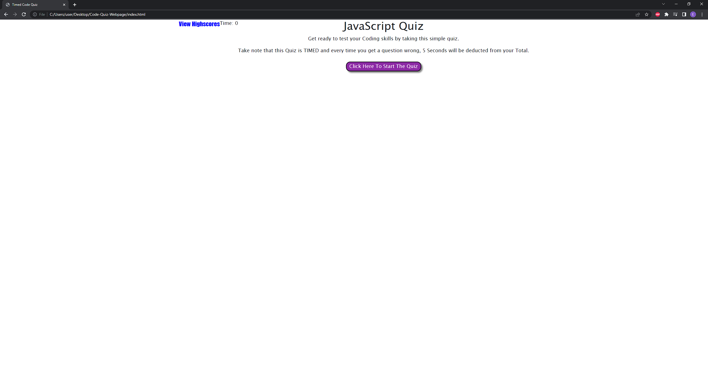

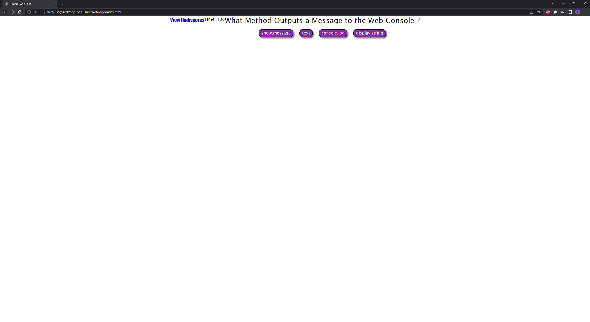

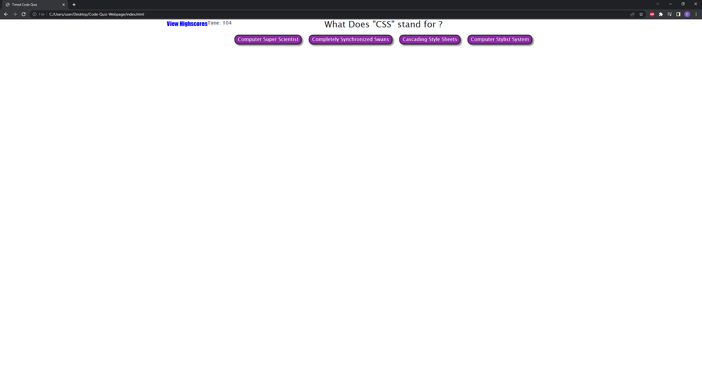

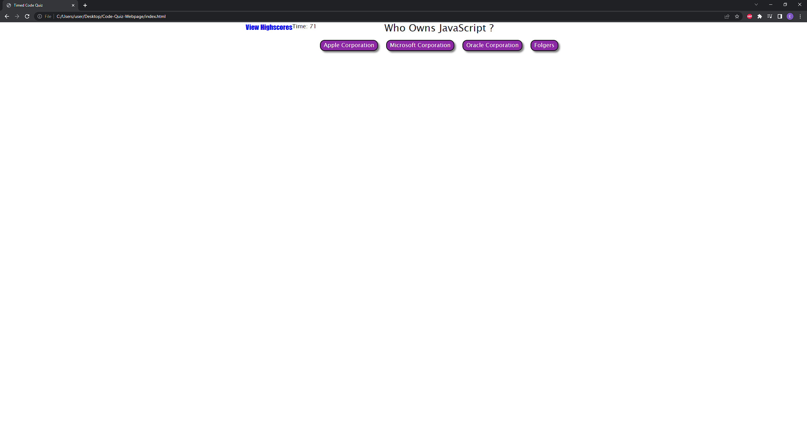

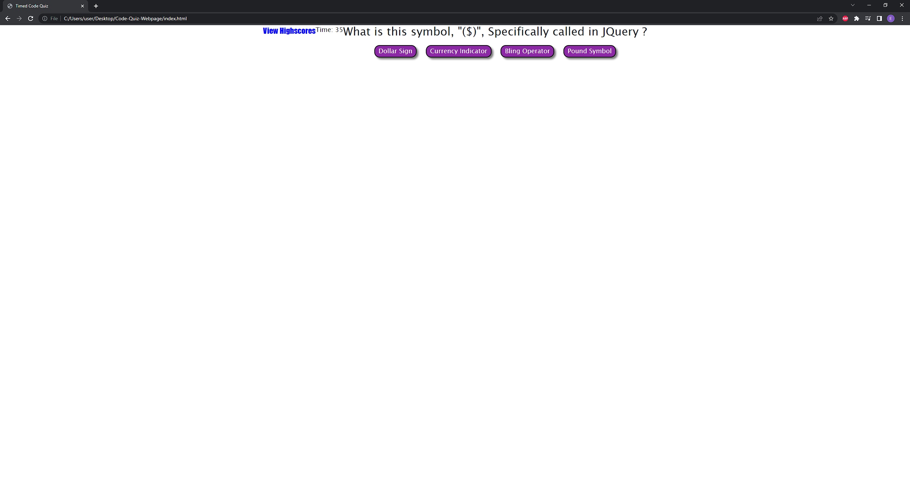

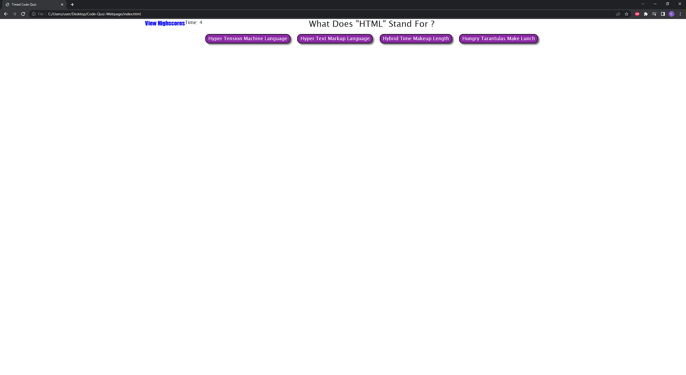

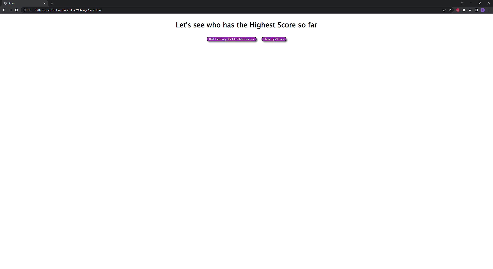

# Links

This is the link to the repository that contains all the code for this challenge : https://github.com/Ervin543/Code-Quiz-Webpage

This is the link that leads to the deployed webpage of this challenge : 
